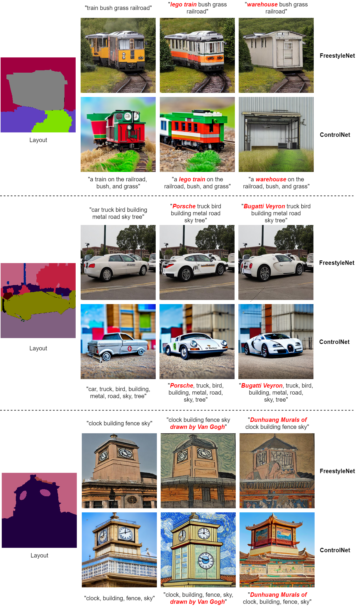

# FreestyleNet
Official PyTorch implementation of [Freestyle Layout-to-Image Synthesis](https://arxiv.org/abs/2303.14412)

[](https://arxiv.org/abs/2303.14412)
[](https://essunny310.github.io/FreestyleNet/)

## Introduction

FreestyleNet is a diffusion-based network that can generate diverse semantics onto a given layout. Compared to prior layout-to-image synthesis methods and text-to-image generation models (e.g., Stable Diffusion), FreestyleNet is armed with more controllability, enabling 1) the generation of semantics beyond the pre-defined semantic categories in the training dataset, and 2) the separate modulation of each class in the layout with text.


## Comparison to [ControlNet](https://github.com/lllyasviel/ControlNet)



## Citation

If you find FreestyleNet useful for your work, please kindly consider citing our paper:

```bibtex
@inproceedings{xue2023freestylenet,
  title = {Freestyle Layout-to-Image Synthesis},
  author = {Xue, Han and Huang, Zhiwu and Sun, Qianru and Song, Li and Zhang, Wenjun},
  booktitle = {Proceedings of the IEEE/CVF Conference on Computer Vision and Pattern Recognition (CVPR)}, 
  year = {2023},
}
```

Code coming soon. Stay tuned!
