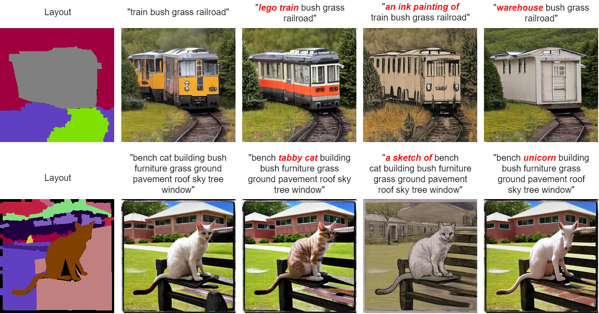

# FreestyleNet
Official PyTorch implementation of [Freestyle Layout-to-Image Synthesis](https://arxiv.org/abs/2303.14412)

[](https://arxiv.org/abs/2303.14412)
[](https://essunny310.github.io/FreestyleNet/)

## Introduction

FreestyleNet is a diffusion-based network that can generate diverse semantics onto a given layout. Compared to prior layout-to-image synthesis methods and text-to-image generation models (e.g., Stable Diffusion), FreestyleNet is armed with more controllability, enabling 1) the generation of semantics beyond the pre-defined semantic categories in the training dataset, and 2) the separate modulation of each class in the layout with text.



A comparison to [ControlNet](https://github.com/lllyasviel/ControlNet) is provided on our [project website](https://essunny310.github.io/FreestyleNet/).

## Updates

- \[2023/04/22\] - Code & pre-trained models released!

## Requirements

Our code is built upon [Stable Diffusion](https://github.com/CompVis/stable-diffusion). Please clone the repository and set up the environment:
```
git clone https://github.com/essunny310/FreestyleNet.git
cd FreestyleNet
conda env create -f environment.yaml
conda activate freestyle
```

You will also need to download the pre-trained Stable Diffusion model (or manually download it from [here](https://huggingface.co/CompVis/stable-diffusion-v-1-4-original)):
```
mkdir models/ldm/stable-diffusion
wget -O models/ldm/stable-diffusion/sd-v1-4-full-ema.ckpt https://huggingface.co/CompVis/stable-diffusion-v-1-4-original/resolve/main/sd-v1-4-full-ema.ckpt
```

## Data Preparation

**COCO-Stuff**. The dataset can be found [here](https://github.com/nightrome/cocostuff). You will need to download *train2017.zip*, *val2017.zip*, and *stuffthingmaps_trainval2017.zip*. Please unzip them and generate two files: `COCO_train.txt` and `COCO_val.txt`, which contain the absolute path of each image (e.g., "/path/to/dataset/COCO-Stuff/train_img/000000000009.jpg"). At last, put them under a directory as follows:
```
COCO-Stuff
    stuffthingmaps_trainval2017/
        train2017/
            000000000009.png
            ...
        val2017/
            000000000139.png
            ...
    train_img/
        000000000009.jpg
        ...
    val_img/
        000000000139.jpg
        ...
    COCO_train.txt
    COCO_val.txt
```

**ADE20K**. The dataset can be downloaded [here](http://data.csail.mit.edu/places/ADEchallenge/ADEChallengeData2016.zip). Please unzip it and generate two files: `ADE20K_train.txt` and `ADE20K_val.txt`, just like we just did for COCO-Stuff, then you should get a directory structure as follows:
```
ADEChallengeData2016
    annotations/
        training/
            ADE_train_00000001.png
            ...
        validation/
            ADE_val_00000001.png
            ...
    images/
        training/
            ADE_train_00000001.jpg
            ...
        validation/
            ADE_val_00000001.jpg
            ...
    ADE20K_train.txt
    ADE20K_val.txt
```

## Training

To train FreestyleNet, run:
```
python main.py --base /path/to/config
               -t
               --actual_resume models/ldm/stable-diffusion/sd-v1-4-full-ema.ckpt
               -n <exp_name>
               --gpus 0,
               --data_root /path/to/dataset
               --train_txt_file /path/to/dataset/with/train.txt
               --val_txt_file /path/to/dataset/with/val.txt
```

We provide two training scripts: `train_COCO.sh` and `train_ADE20K.sh`. Please modify `--data_root`,  `--train_txt_file`, and `--val_txt_file` according to the actual path.

## Pre-trained Models

We provide two models trained on COCO-Stuff and ADE20K respectively.
* [freestyle-sd-v1-4-coco.ckpt](https://drive.google.com/file/d/1bAGXJKBXaOVRrJYd08LakOFNoWHhFiBm/view?usp=sharing)
* [freestyle-sd-v1-4-ade20k.ckpt](https://drive.google.com/file/d/1PDoMWRI7EVQc5FyLMClz9e6xtM2DbbD1/view?usp=sharing)

## Generation

### Layout-to-Image Synthesis (LIS)

To generate images under the traditional LIS setting, run:
```
python scripts/LIS.py --batch_size 8
                      --config /path/to/config
                      --ckpt /path/to/trained_model
                      --dataset <dataset name>
                      --outdir /path/to/output
                      --txt_file /path/to/dataset/with/val.txt
                      --data_root /path/to/dataset
                      --plms 
```
We provide two sampling scripts: `sample_COCO.sh` and `sample_ADE20K.sh`. Please modify `--ckpt`, `--txt_file`, and `--data_root` according to the actual path.

### Freestyle Layout-to-Image Synthesis (FLIS)

To generate images in a freestyle way, you need to prepare a layout image and a json file that defines the mapping between text and layout.
```
{
  "text_label_mapping": {
    "book": 83, # each mapping should be formatted as <"text": label_value>
    "vase": 85,
    "flower": 118,
    "furniture": 122,
    "paper": 138,
    "plastic": 142,
    "table": 164,
    "concrete wall": 171
  },
  "layout_path": "examples/layout_flower.png"
}
```
* Binding new attributes/generating unseen objects: Just describe the object with the desired attribute or describe a new object, e.g., change <"flower": 118> to <"sunflower": 118>.
* Specifying the style: Just add a description of the desired image style, e.g., add a line to the "text_label_mapping" such as <"drawn by Van Gogh": -1>. Here "-1" means that we want to apply the style globally (e.g., no layout constraint).


We provide several examples in `examples/` and you try them out by running:
```
python scripts/FLIS.py --config configs/stable-diffusion/v1-inference_FLIS.yaml
                       --ckpt /path/to/trained_model
                       --json examples/layout_flower.json \
                       --outdir outputs/FLIS \
                       --plms 
```                                             
A reference script `sample_FLIS.sh` is provided as well.

## Citation

If you find FreestyleNet useful for your work, please kindly consider citing our paper:

```bibtex
@inproceedings{xue2023freestylenet,
  title = {Freestyle Layout-to-Image Synthesis},
  author = {Xue, Han and Huang, Zhiwu and Sun, Qianru and Song, Li and Zhang, Wenjun},
  booktitle = {Proceedings of the IEEE/CVF Conference on Computer Vision and Pattern Recognition (CVPR)}, 
  year = {2023},
}
```

## Acknowledgments

Our code borrows heavily from [Stable Diffusion](https://github.com/CompVis/stable-diffusion) and [Textual Inversion](https://github.com/rinongal/textual_inversion).
